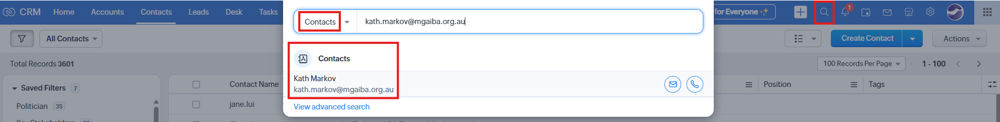
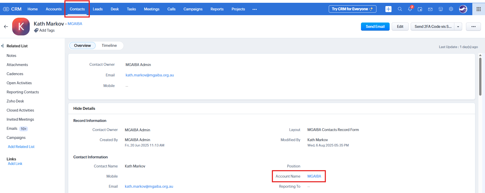
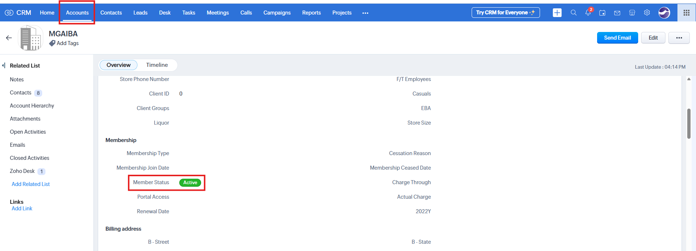

# Troubleshooting Member Registration

**Version:** 1.0  
**Last Updated:** 8 August 2025

---

## Overview

This guide outlines the process for the MGA Membership Team to troubleshoot cases where a member is unable to register for the client portal. Registration eligibility is determined by information stored in Zoho CRM.

---

## Terminology

- **Contact:** A person record in Zoho CRM under the **Contacts** module.
- **Account:** The company record linked to a Contact in Zoho CRM.
- **Member Status:** A field on the Account record that indicates whether the company’s membership is Active or Inactive.

---

## Registration Criteria

A member **can only register** for the client portal if **all** of the following conditions are met in Zoho CRM:

1. **Email Address Exists in Contacts**

   - The member’s email address must be listed under a Contact in the **Contacts** module.

2. **Associated Account Exists**

   - The **Account Name** field on that Contact must not be empty.

3. **Account Membership is Active**
   - When viewing the linked Account record, the **Member Status** field must be set to **Active**.

---

## Steps to Troubleshoot Registration Issues

When a member reports that they are unable to register:

1. **Search for the Member’s Email in Contacts**

   - Use the search bar to locate the member’s email address
   - Change the Search Modules from All Modules to **Contacts**.
   - **If found:** Criteria 1 is met.  
     

2. **Check the Associated Account Name**

   - Open the Contact record.
   - Look at the **Account Name** field.
   - **If not empty:** Criteria 2 is met.  
     

3. **Verify Member Status on the Account**

   - Click on the **Account Name** link.
   - Locate the **Member Status** field.
   - **If set to Active:** Criteria 3 is met.  
     

4. **Determine Registration Outcome**
   - **If all three criteria are met:** The member should be able to register.
   - **If any criteria are not met:** The member will not be able to register until the missing condition(s) are corrected in Zoho CRM.

---

## Registration Outcome Messages

When a member attempts to register and one or more criteria are not met, the client portal will display an on-screen error message.

| **Scenario** | **Condition Not Met**                 | **Message Shown to Member**                                                                                            |
| ------------ | ------------------------------------- | ---------------------------------------------------------------------------------------------------------------------- |
| 1            | Email address not found in Contacts   | _"We could not find a contact associated with this email address. Please check your details and try again."_           |
| 2            | No Account linked to the Contact      | _"There is no account linked to this email address. Please contact our support team for assistance."_                  |
| 3            | Account’s Member Status is not Active | _"Your membership is currently inactive. Access has been denied. Please contact our team to reactivate your account."_ |

---

## Data Sync Delay

- Changes made in Zoho CRM take **approximately 5–10 minutes** to appear in the client portal.
- This delay is due to caching, which helps optimise system performance.
