# Adding a Call Time Entry

**Version:** 1.0  
**Last Updated:** 8 June 2025  

---

## Notes

There are two components when logging a call:

1. **Duration in Call Activity:** Automatically tracked during live calls.  
2. **Duration in Time Entry of Call Activity:** Manually added to include preparation and follow-up time.

---

## Logging a Current Call

1. Open the relevant ticket.  
2. Go to **ACTIVITY > Add Activity > Call**.  
    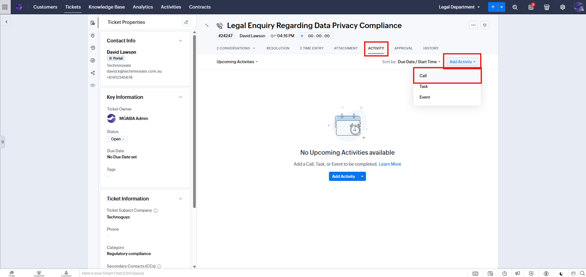

3. Fill in **Subject**, **Direction**, **Call Status:** Current Call, and **Description**. 
    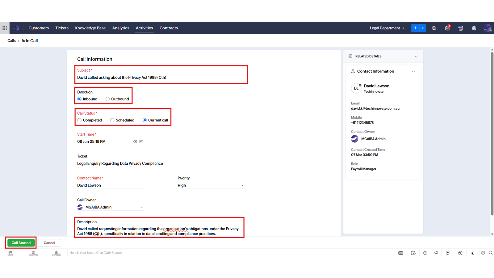

4. Click **Call Started**.  

5. On the popup phone, click **Answered** to begin timer.
    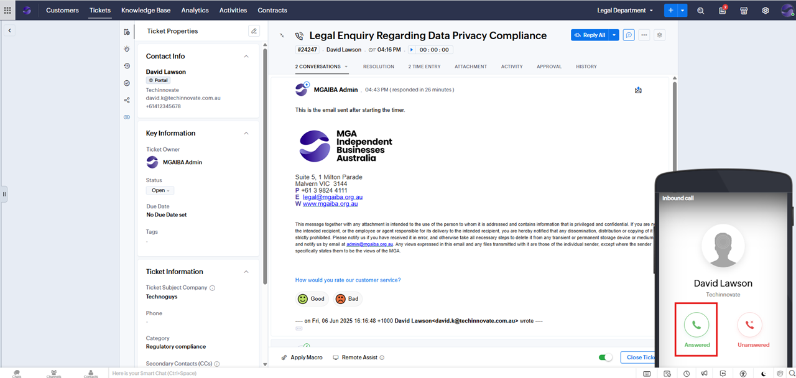

6. Use the popup phone to manage the call. After the call ends, click **End Call > Close**.

    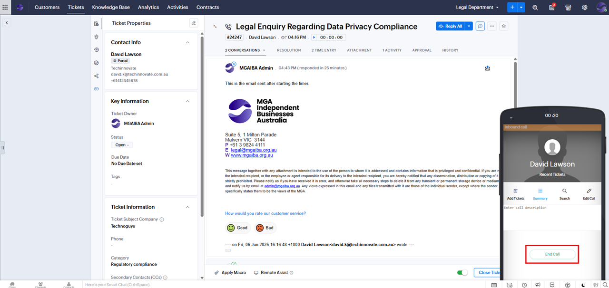
    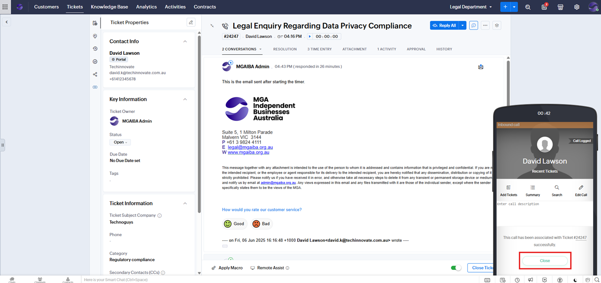

7. The time entry will be saved under the **TIME ENTRY** tab.
   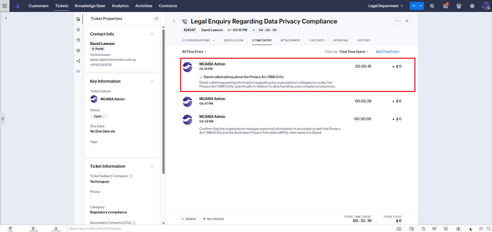

## Logging a Completed Call

1. Open the relevant ticket.  
2. Go to **ACTIVITY > Add Activity > Call**.  
   

3. Fill in **Subject**, **Direction**, **Call Status:** Completed, **Start Time**, **Duration**, and **Description**.  
    _Please note that the duration field here refers to the call activity itself, not the time entry. This means it will not be used in report generation. The actual time entry duration, which is used for reporting, will be recorded in a later step._
   

4. Click **Submit**.  
5. Switch to **All Activities** in the **ACTIVITIES** tab..
   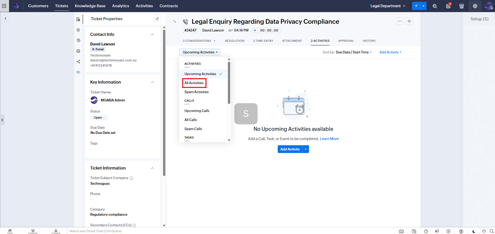

6. Open the newly created completed call.
   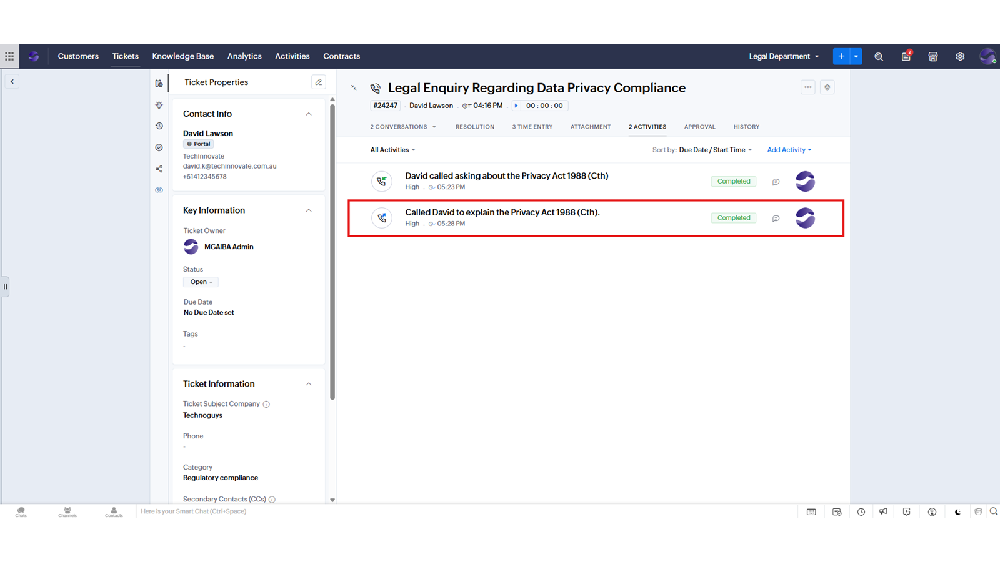

7. Go to the **TIME ENTRY** tab and click **Add Time Entry**.  
   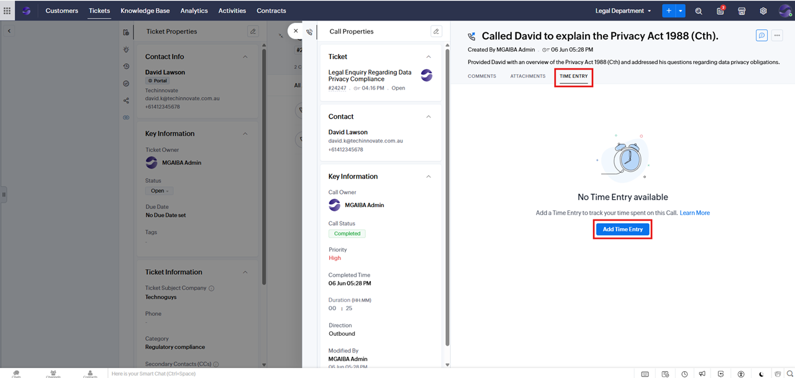

8. Fill in **Executed Time**, **Duration**, and **Description**.  
   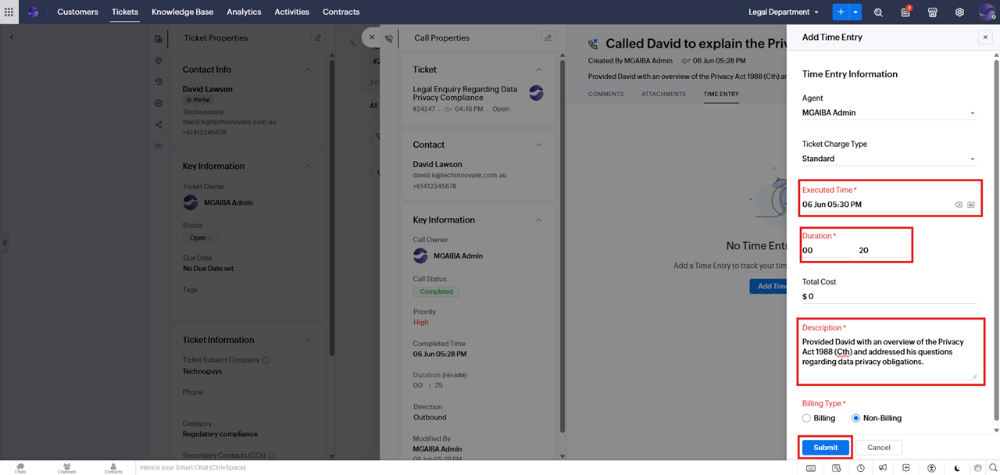

9. Click **Submit**. The new **Time Entry** will be added in both the call's **TIME ENTRY** tab and the ticket's **TIME ENTRY** tab.
   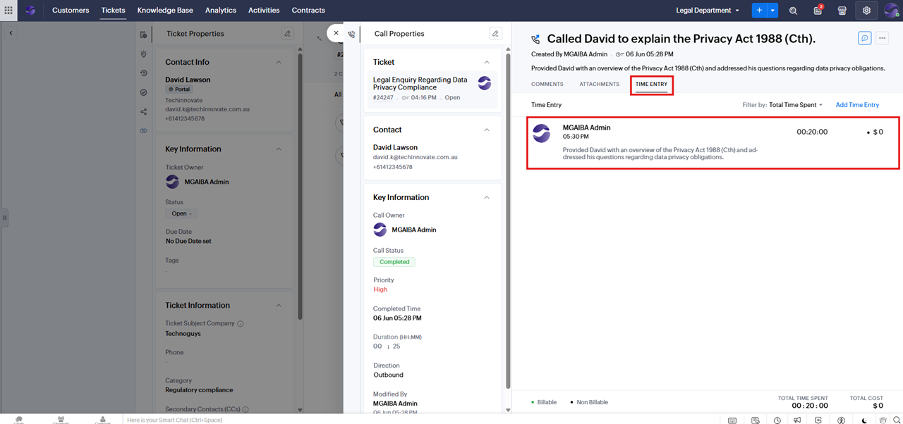
   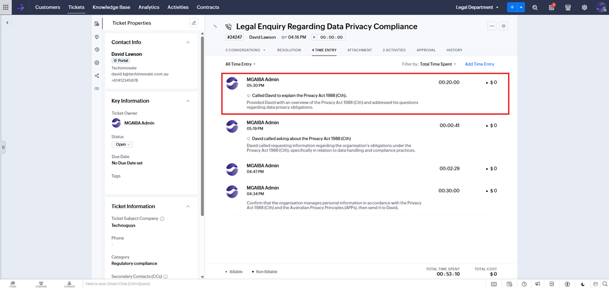

