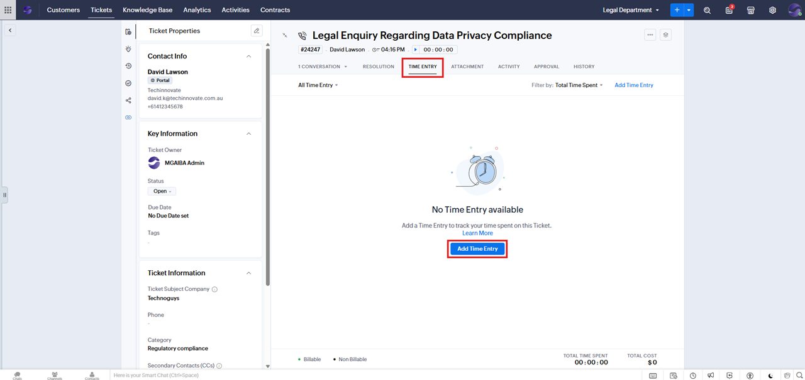
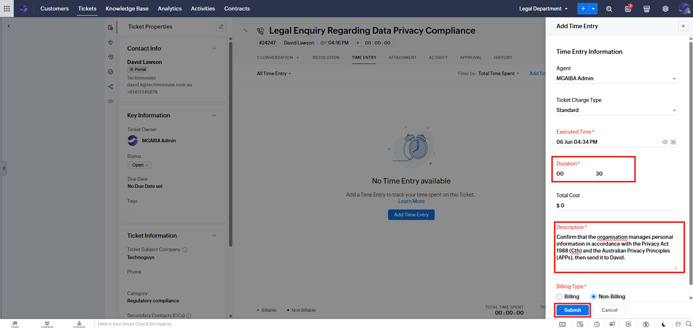
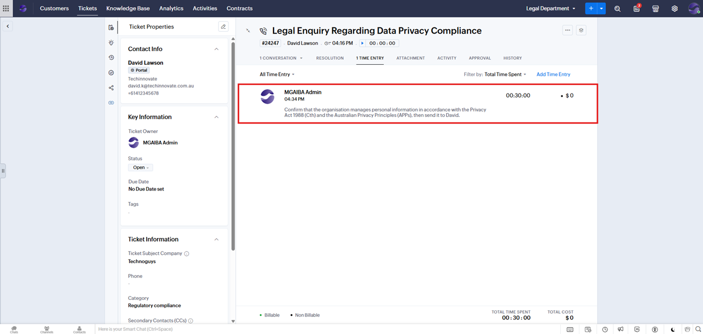
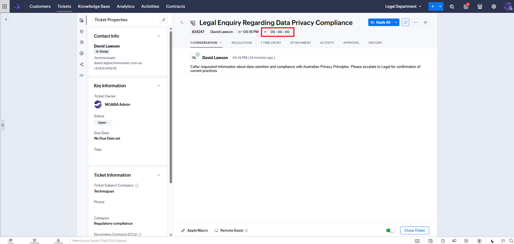
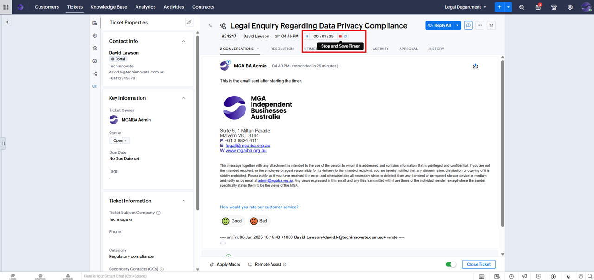
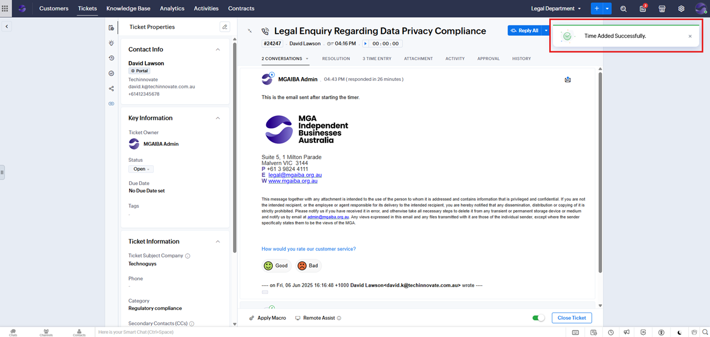
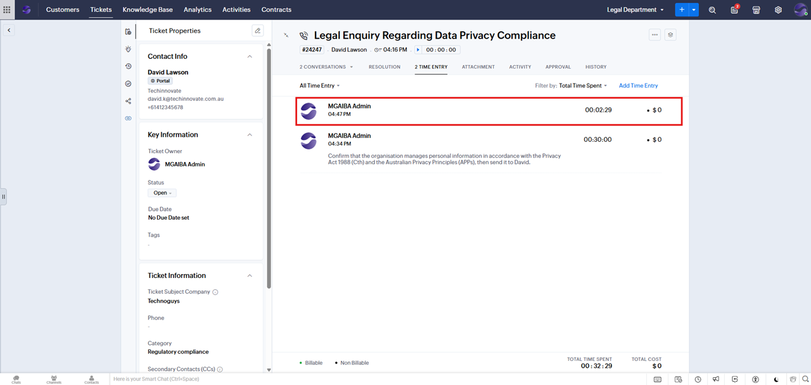

# Adding an Email Time Entry

**Version:** 1.0  
**Last Updated:** 8 June 2025  

---

## Method 1: Manual Entry

1. Open the ticket you've worked on.
2. After sending the email, go to the **TIME ENTRY** tab and click **Add Time Entry**.
   

3. Fill in the **Duration** and **Description** fields.  
    Leave **Total Cost** as **$0** and **Billing Type** as **Non-Billing** (These can be configured later when financial integration is processed).
    

5. Click **Submit**. The new **Time Entry** will be added.
   

## Method 2: Using the Timer

1. Open the ticket before starting your email.
2. Click **Start Timer**.
   

3. After completing the email, click **Stop and Save Timer**.
   

4. A confirmation message will appear, and the time entry will be added automatically.
   
   

