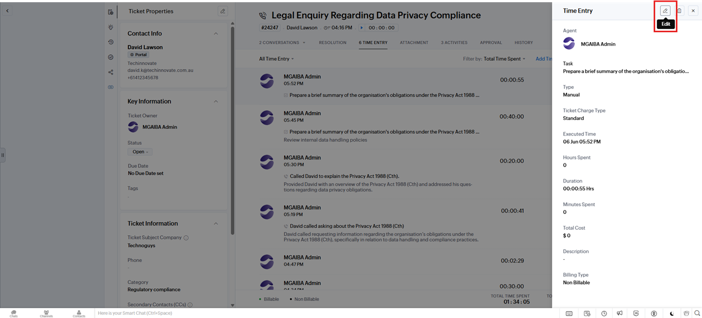
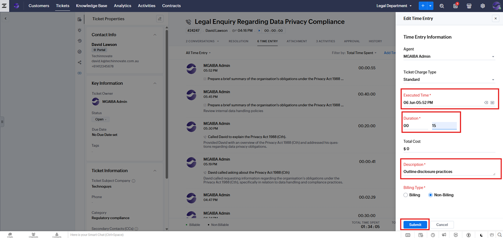

# Modifying a Time Entry

**Version:** 1.0  
**Last Updated:** 8 June 2025  

---

If you need to update a time entry:

1. Open the time entry from the **TIME ENTRY** tab.  
2. Click the **Edit** icon.  
   

3. Update the necessary fields (**Executed Time**, **Duration**, **Description**).  
   

4. Click **Submit**.
