# Adding a Task Time Entry

**Version:** 1.0  
**Last Updated:** 8 June 2025  

---

## Method 1: Manual Entry

1. Open the ticket.  
2. Go to **ACTIVITY > Add Activity > Task**.  
   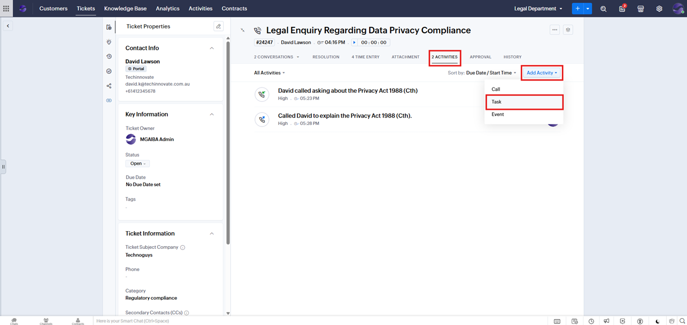

3. Fill in **Subject**, **Due Date** (optional), **Description**, and **Reminder** (optional). 
   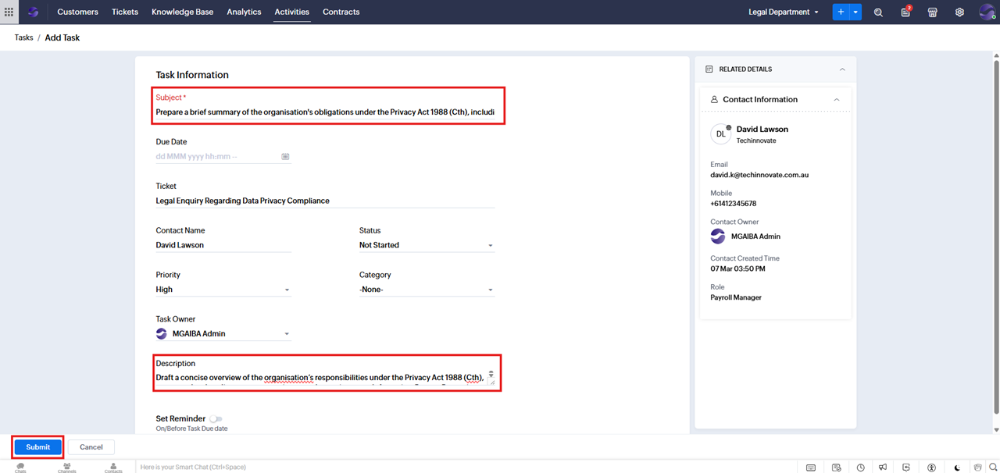

4. Click **Submit**.  
5. Switch to **All Activities**, then open the task.  
   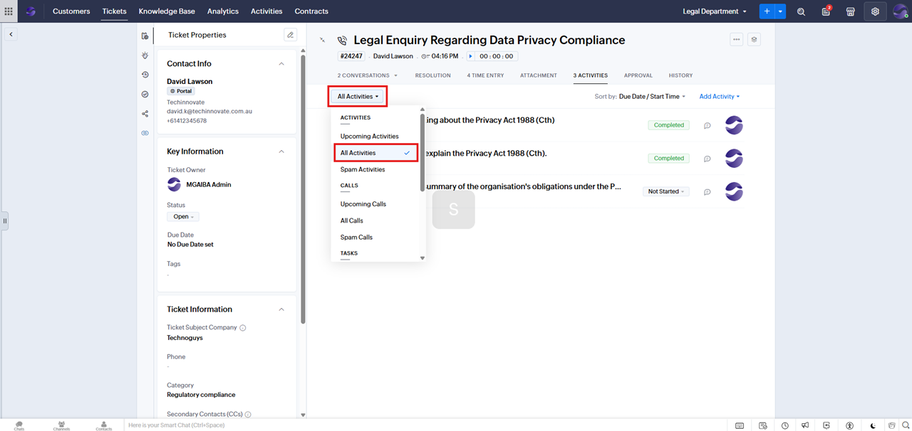
   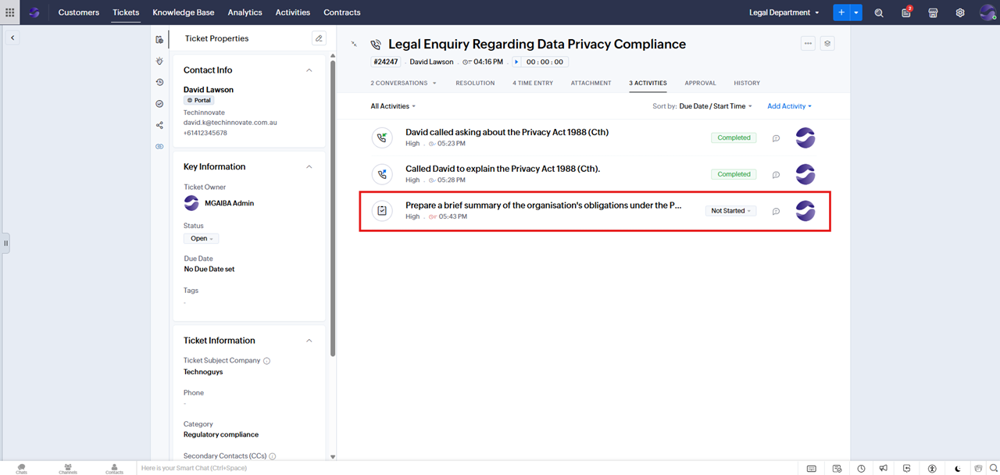

6. Go to the **TIME ENTRY** tab and click **Add Time Entry**.  
   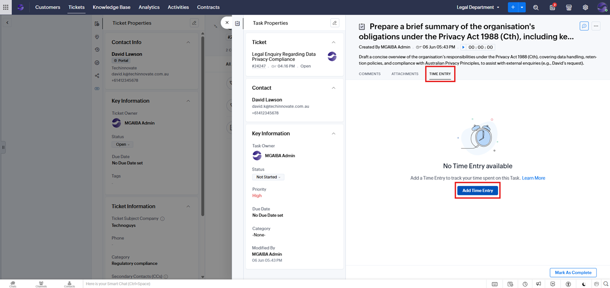

7. Fill in **Executed Time**, **Duration**, and **Description**. 
   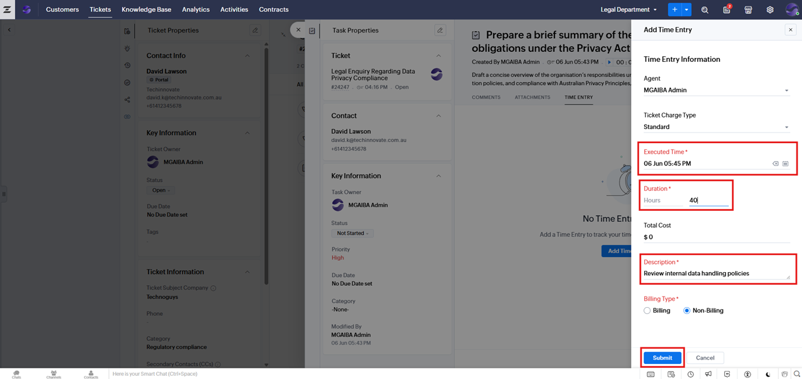

8. Click **Submit**. The new **Time Entry** will be added in both the task's **TIME ENTRY** tab and the ticket's **TIME ENTRY** tab.
   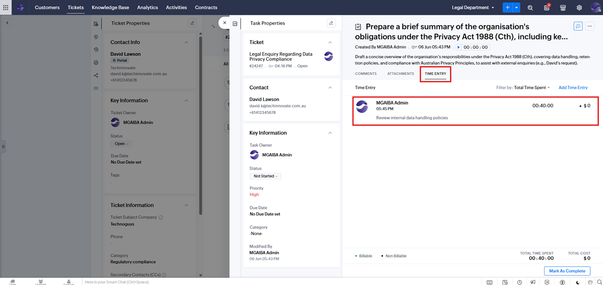
   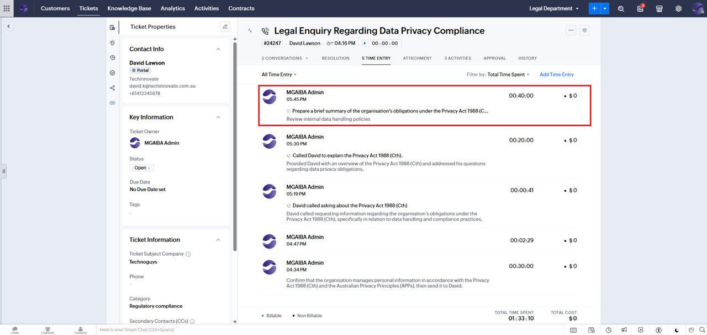

## Method 2: Using the Timer

1. To create a new task, follow the steps up to **Step 5** under **Method 1: Manual Entry**, as outlined above, and then open the created task.
2. In the **TIME ENTRY** tab, click **Start Timer**.  
   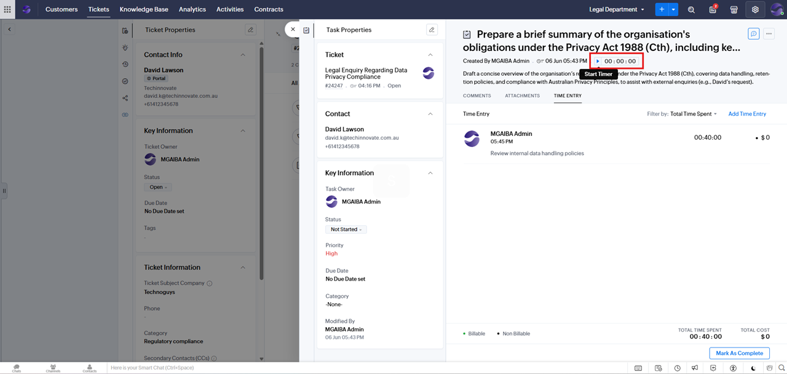

3. Complete the task, then click **Stop and Save Timer**.  
   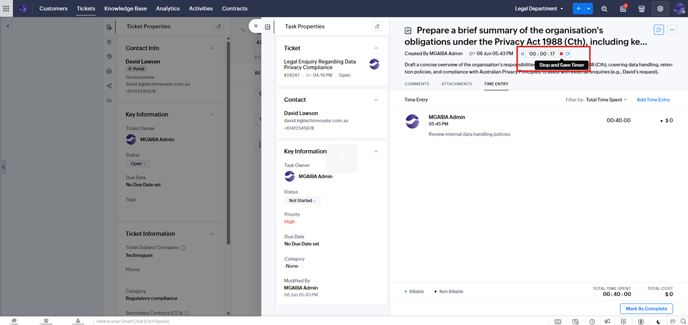

4. The time entry will be logged automatically in both the task's **TIME ENTRY** tab and the ticket's **TIME ENTRY** tab..
   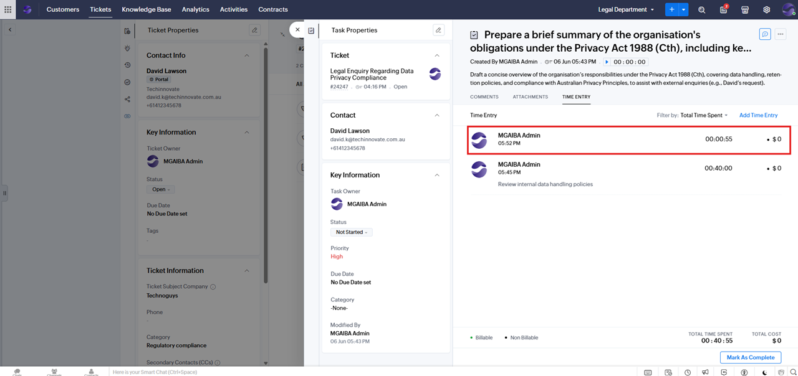
   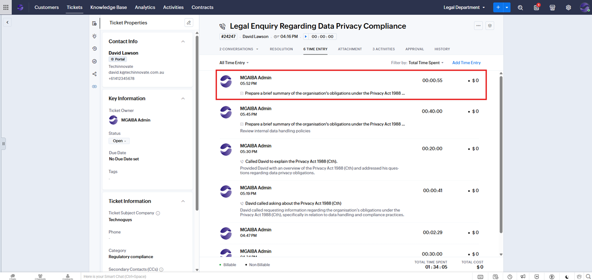

