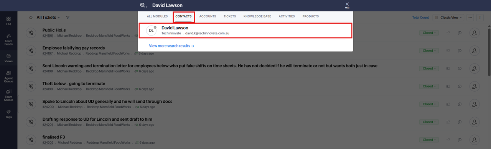
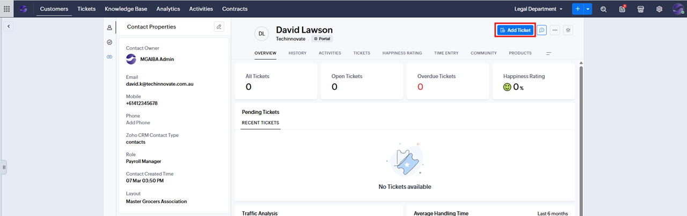
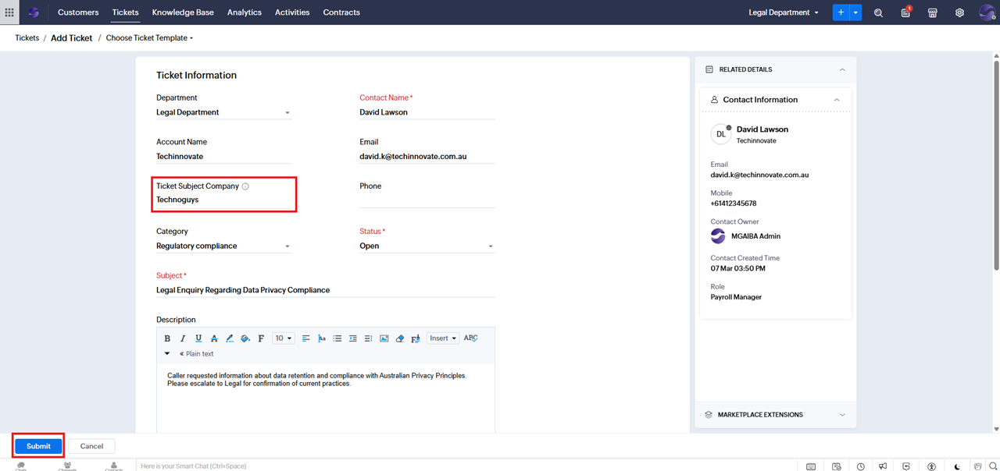

# Creating a Ticket

## Overview

This guide outlines how to create and manage support tickets in scenarios involving MSO (Multi-Site Organisation) accounts and their associated stores. Tickets may be raised either by MSO headquarters contacts or by store-level contacts.

---

## Terminology

- **Account:** Represents a company.
- **MSO Account:** The headquarters (e.g., Techinnovate)
- **MSO Store:** A child account under the MSO (e.g., Technoguys)
- **Contact:** A person associated with an account (e.g., Store Owner, Manager, Payroll Manager)

## Creating a Ticket

There are two common scenarios when creating a ticket on behalf of a caller:

- **MSO Head Office:** Techinnovate  
  **Contact:** David Lawson (Payroll Manager)

- **MSO Store (Child Account):** Technoguys  
  **Contact:** Amber Taylor (Store Owner)

- **Scenario 1:** Caller submitting a ticket for their own account  
  **Example:** Amber Taylor (Technoguys) calls about an issue at Technoguys.

- **Scenario 2:** Caller submitting a ticket regarding a child account  
  **Example:** David Lawson (Techinnovate) calls about an issue at Technoguys.

### Steps to Create a Ticket

1. Click the search icon, type the caller’s name, and select the relevant Contact.
   
   

2. Click **Add Ticket**.
   

3. Fill in the ticket form.  
    3.1 Some fields will be automatically prefilled, such as **Contact Name** and **Account Name**.  
    3.2 Complete the **Category**, **Subject** (required), and **Description** fields. Fill in additional fields as required.  
    3.3 **Scenario 2 only:** Select the child company in the **Ticket Subject Company** field.  
        - If the caller is reporting an issue about a child company (e.g., a Head Office Contact reporting on a store), choose the appropriate child company from the list.  
    3.4 **Scenario 1 only:** Leave the **Ticket Subject Company** field blank.  
        - If the issue relates to the company the contact belongs to, do not select anything in this field.  
    

4. Click **Submit** to create the ticket.  
5. Once created, the ticket will be available for activity tracking and further updates.

