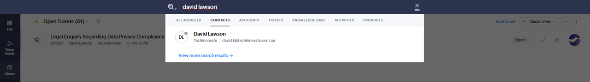
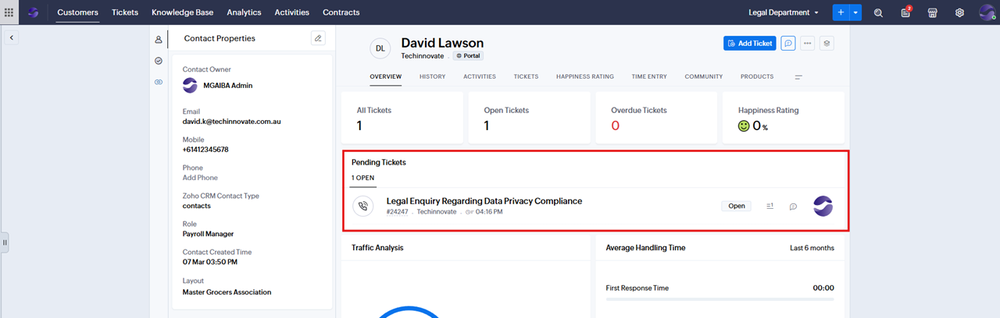
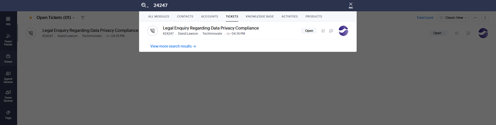

# Finding (Revisiting) a Ticket

If a caller contacts you to follow up on a previous ticket (e.g., regarding a legal enquiry):

1. Click the search icon, type the caller’s name, and select the Contact.
   

2. Under the **Pending Tickets** section or the **Tickets** tab, locate the ticket in question.
   

3. If the caller provides the Ticket Number, you may search for it directly using the search icon.
   
