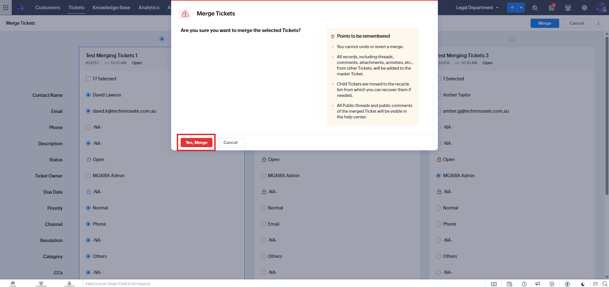

# Merging Tickets in Zoho Desk

**Version:** 1.0  
**Last Updated:** 18 June 2025

---

## Overview

Zoho Desk allows tickets to be merged in two ways:

- From the **Tickets Module View** – enables merging tickets across different contacts
- From the **Timeline** within a ticket – used for tickets belonging to the same contact or account

---

## Important Notes

- Only tickets from the **same department** can be merged  
- Once tickets are merged, they **cannot be unmerged**  
- A **maximum of five** tickets can be merged at once

---

## Part 1: Merging from the Tickets Module View

  1. **Open the Tickets Module**

   - Go to the **Tickets** module in Zoho Desk  
   - Select the relevant **Department**
   - 

   2. **Select Tickets to Merge**

   - Tick the checkboxes beside the tickets you want to merge  
   - These can be from **different contacts** (within the same department)

   3. **Click Merge**

   - From the **Mass Actions** toolbar, click **Merge**
   - 

   4. **Choose Fields to Retain**

   - On the **Merge Ticket** page, select the field values you want to retain in the tickets
   - 

   5. **Confirm the Merge**

   - Click **Merge**, then confirm by selecting **Yes, Merge**
   - 

   6. **Verify Merge Success**

   - A success message will appear confirming the tickets have been merged
   - 

---

## Part 2: Merging from the Ticket Timeline

This method is used when the tickets belong to the same contact or account.

  1. **Open a Ticket**

   - Navigate to the **Ticket Module** and open one of the tickets to be merged

   2. **Access Timeline View**

   - In the ticket’s detail view, click on **Timeline**
   - 

   3. **Select and Merge Tickets**

   - Tick the checkboxes beside the tickets you want to merge  
   - Click **Merge**
   - 

---

## Completion

You have successfully:

- Merged tickets using both the **Tickets Module View** and the **Timeline View**
- Consolidated information by selecting which fields to retain in the master ticket