# Managing Duplicate Contact Creation (Merging) and Ticket Move

**Version:** 1.0  
**Last Updated:** 10 June 2025

---

## Overview

When an email is sent to **legal@mgaiba.org.au**, a ticket is automatically created in **Zoho Desk**. However, this process can sometimes result in the creation of duplicate contacts in both **Zoho Desk** and **Zoho CRM**.

This duplication typically occurs when existing contacts in Zoho CRM or Zoho Desk do not have an associated email address. As a result, Zoho cannot match the incoming email to the correct existing contact and creates a new one.

---

## Purpose

This guide outlines the correct process for:

- Identifying and safely merging duplicate contacts in Zoho CRM
- Moving the associated ticket from the duplicated contact to the correct existing contact in Zoho Desk
- Removing the duplicated contact from Zoho Desk once the ticket has been moved

---

## Part 1: Merging Duplicate Contacts in Zoho CRM

  1. **Search for the Contact**

   - Open Zoho CRM and search by the contact’s name.
   - If two contacts appear (typically one with an email and one without), they need to be merged.  
     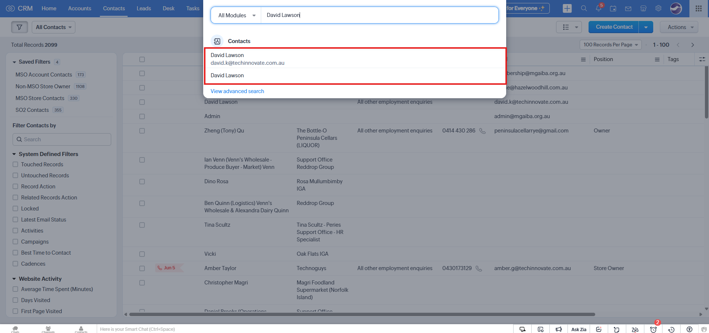

   2. **Find and Merge Duplicates**

- Open either of the contact records
- Click the three-dot menu in the top-right corner
- Select **Find and Merge Duplicates**  
  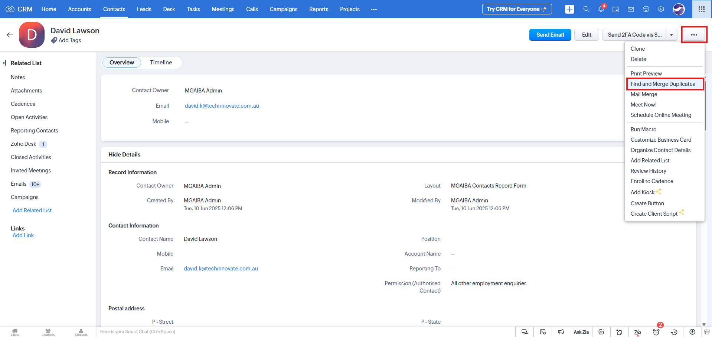

   3. **Select Matching Records**

- Zoho CRM will list potential matching records under **Matching Records**
- If no matches appear, use the **Search Criteria** to find the duplicate manually  
  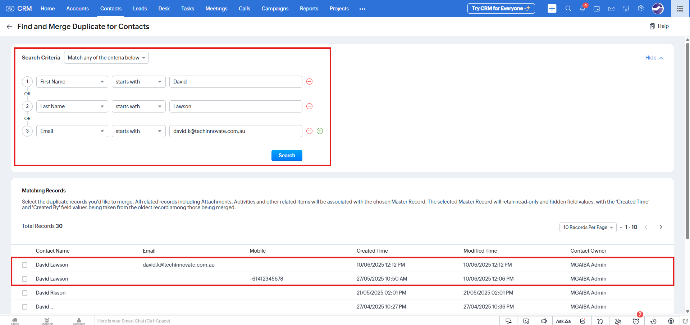

   4. **Compare and Merge**

- **Tick both** matching contacts and click **Next**
  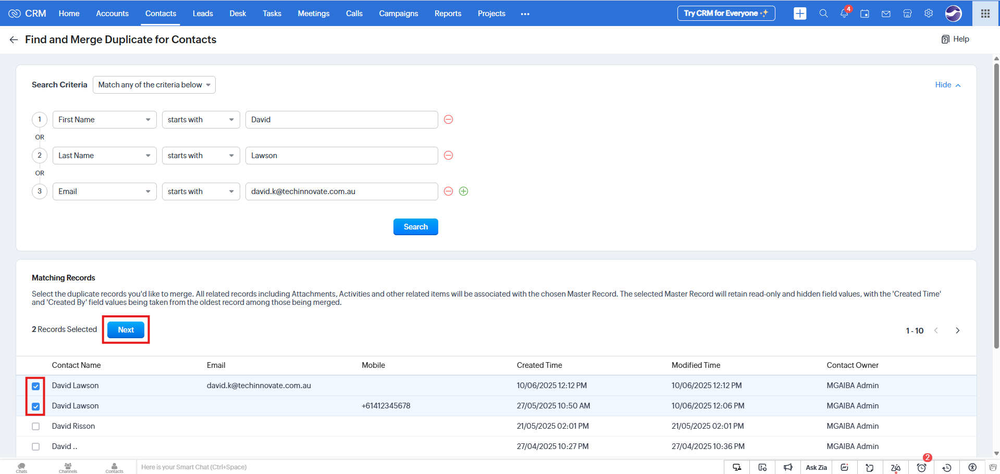

- Compare **Record 1** and **Record 2**
- Choose the correct details to retain in the merged contact
- Ensure the **email address** is included  
   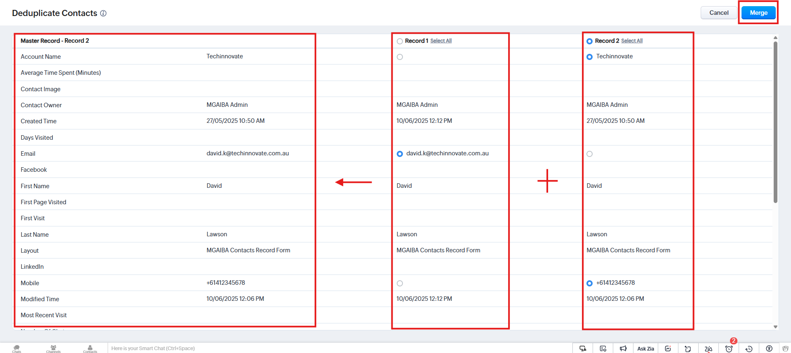

- Click **Merge** and confirm by clicking **Yes, Merge Records**
  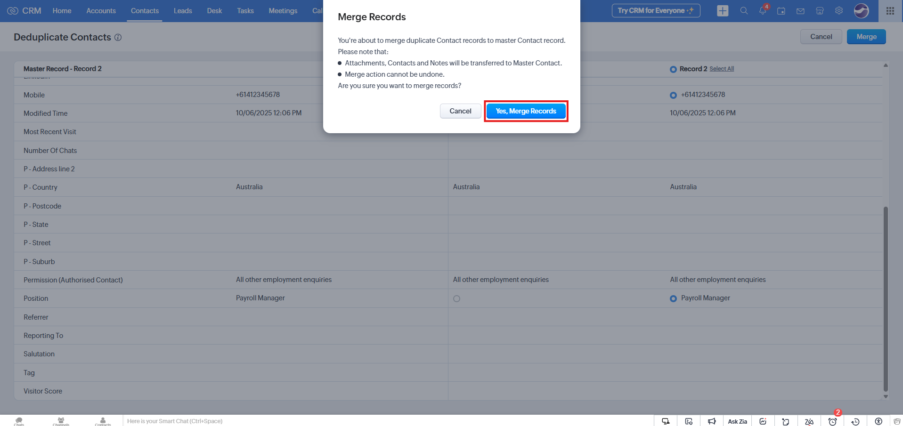

   5. **Verify Merge**

- After the success message appears, search the contact name again
- Use **Advanced Search** to ensure only one contact remains
  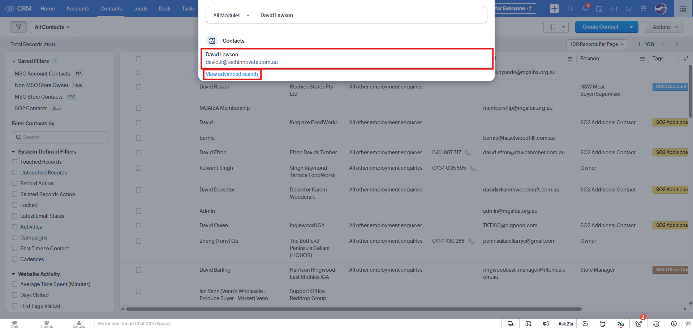
  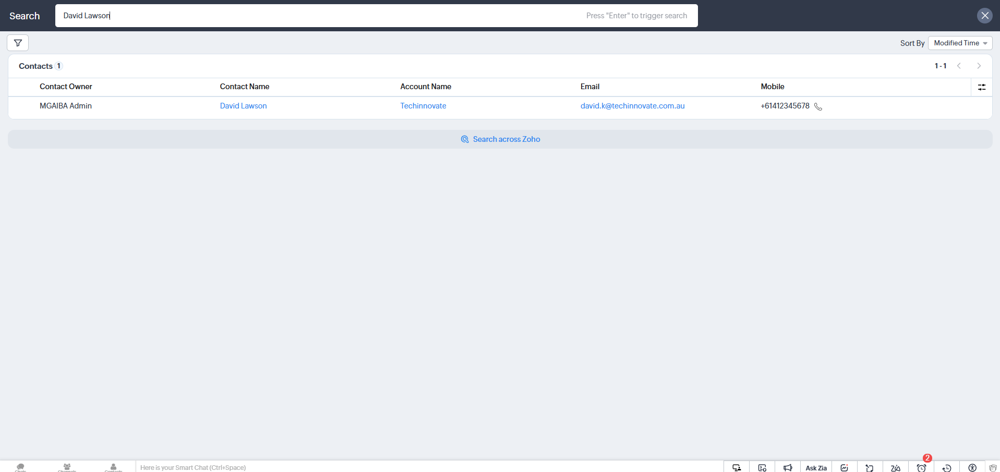

---

## Part 2: Moving the Ticket in Zoho Desk

  1. **Identify Duplicate Contacts**

   - In Zoho Desk, search for the contact name
   - You should see two contact entries
     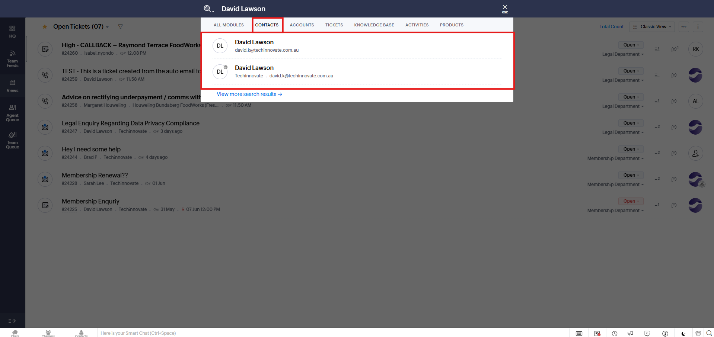

   2. **Compare Creation Dates**

- Open both contact records
- Compare the **Contact Created Time** fields
- The older contact is the original; the newer one is the duplicate
  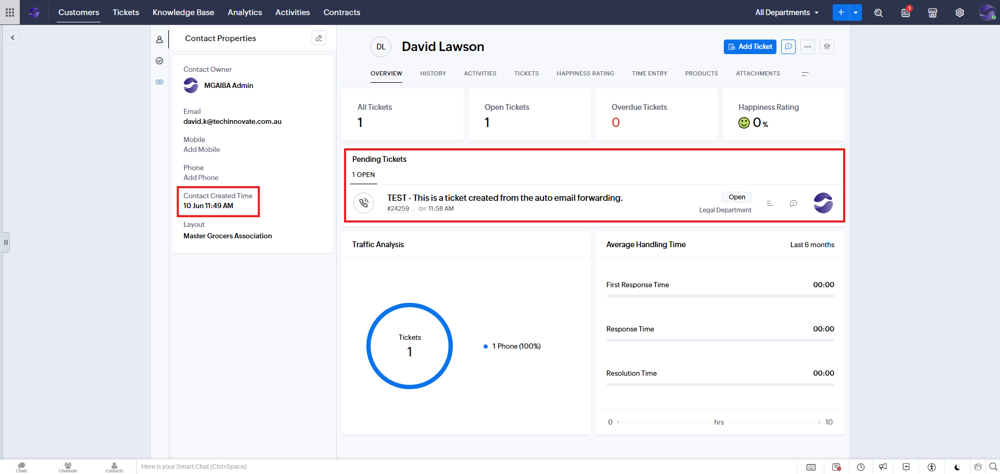
  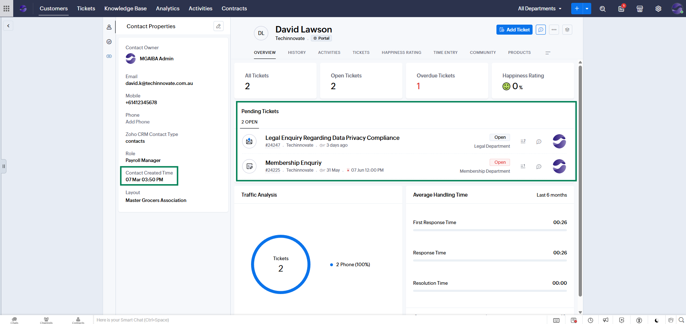

   3. **Reassign the Ticket**

- Open the ticket associated with the duplicated (newer) contact
  

- Click the **Edit** button next to **Ticket Properties**
  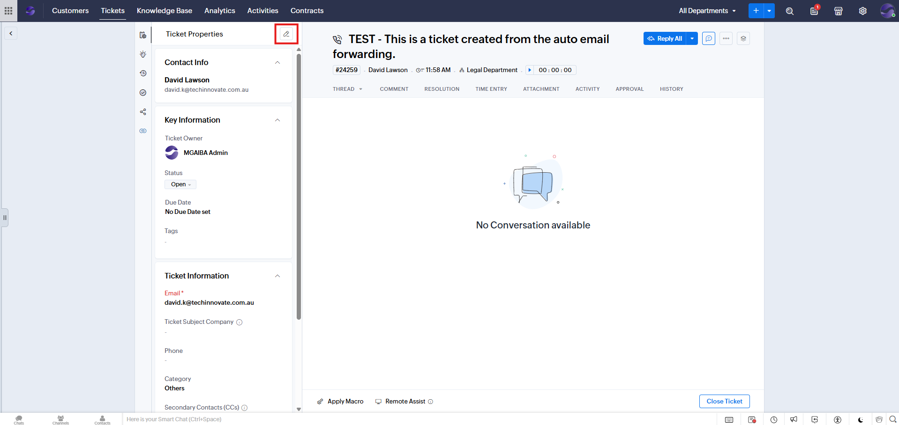

- In the **Contact Name** field, search and select the older (original) contact
  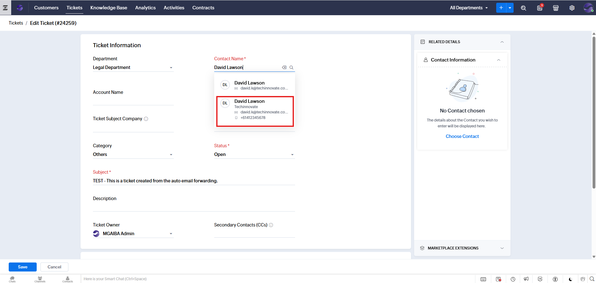

- Confirm the **Contact Created Time** on the right-hand side is correct
  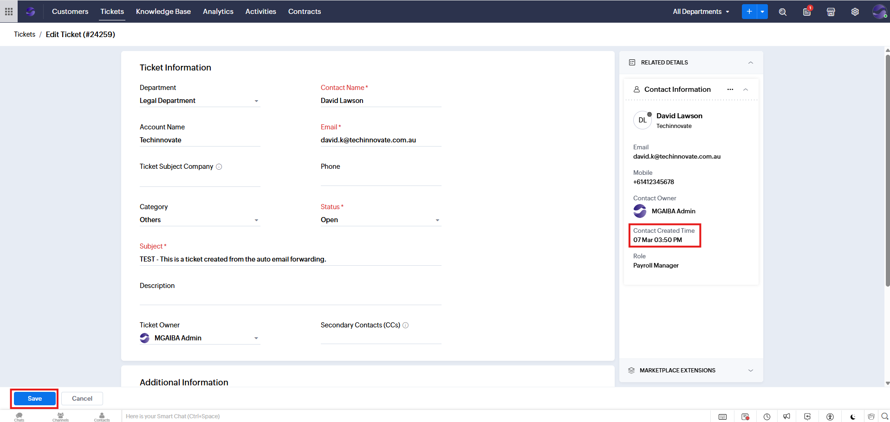

- Click **Save**

   4. **Verify Ticket Move**

- Search the contact name again and open both records
- Check that the ticket has been moved to the correct contact
    - _(Note: This may take a few minutes—refresh the page if necessary.)_
  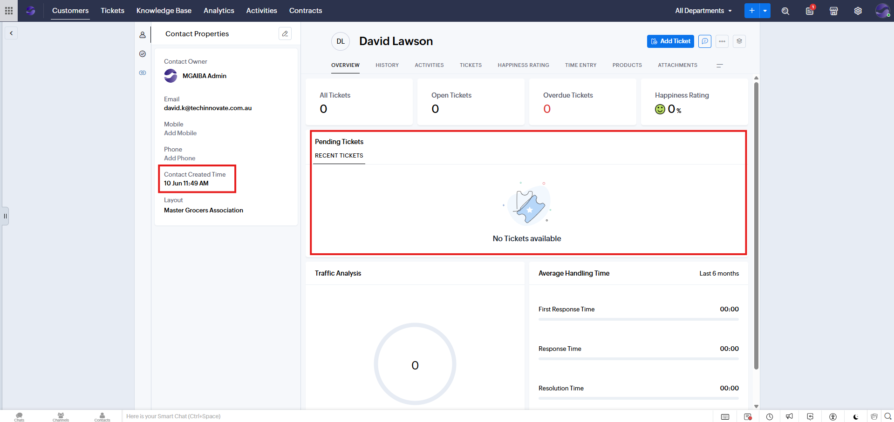
  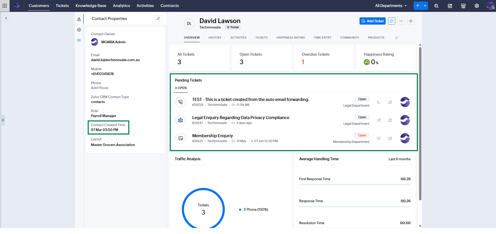

---

## Part 3: Deleting the Duplicated Contact

  1. **Delete the Duplicate**
   - Open the contact record for the duplicated (newer) contact
     

   - Click the three-dot menu in the top-right corner and select **Delete**
     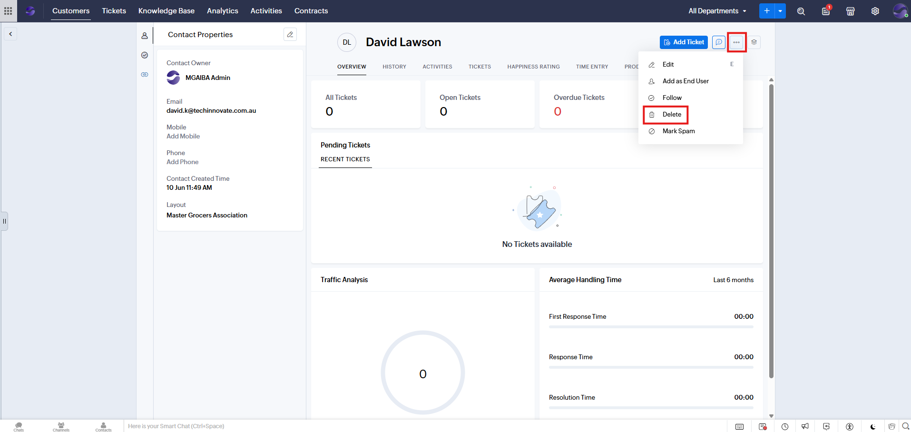

   - Confirm deletion
     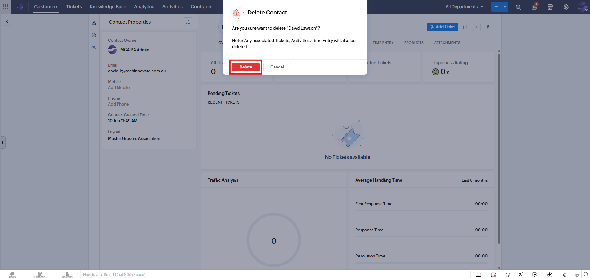

---

## Completion

You have successfully:

- Merged duplicate contacts in **Zoho CRM**
- Reassigned the ticket in **Zoho Desk**
- Removed the duplicate contact
