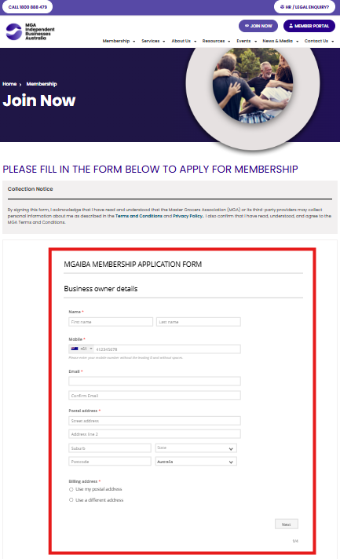
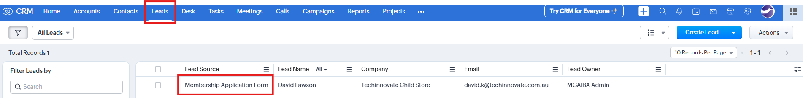
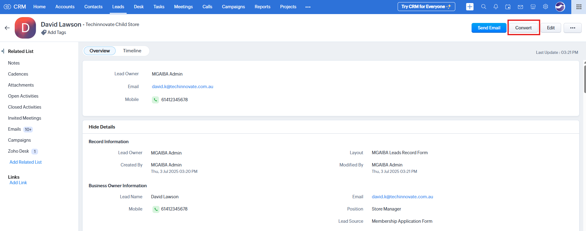
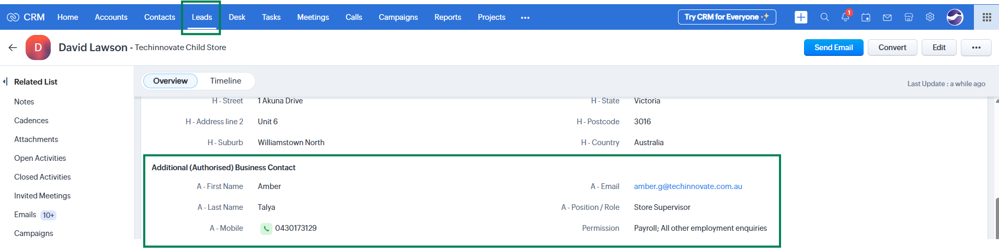
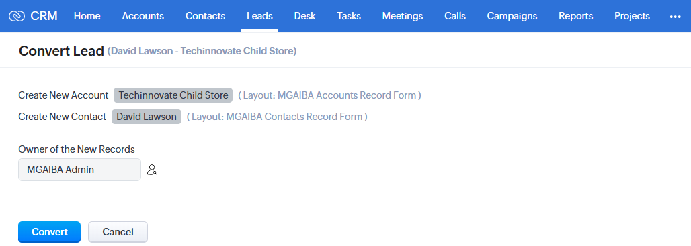
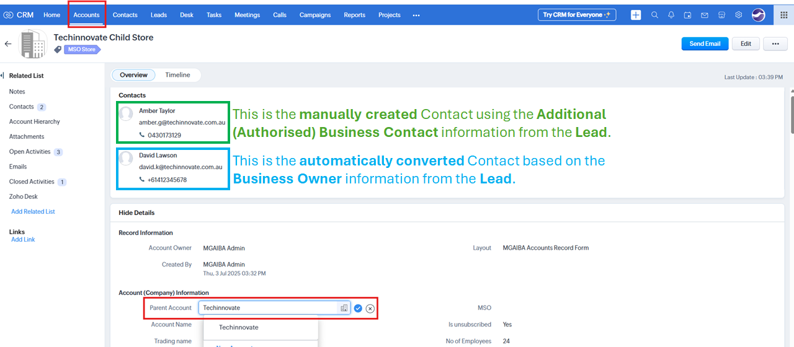

# New Member Onboarding Process

**Version:** 1.0  
**Last Updated:** 8 July 2025  

---

## Overview

This guide outlines the process for onboarding new MGA members into Zoho CRM, based on how the membership application is submitted. The process varies depending on whether the submission occurs via the online website form or through a manual (PDF or printed) application.

---

## Terminology

- **Lead:** A potential member created in Zoho CRM from the submitted membership application.  
- **Account:** The business entity associated with the member.  
- **Contact:** The authorised person representing the account.  
- **MSO Account:** A head office or parent business entity.  
- **MSO Store:** A store operating under a parent MSO Account.

---

## Channel 1: Online Submission (Website)

1. The user navigates to the MGA website and completes the membership application form.
   - 

2. Upon submission:
   - A **new Lead** is automatically created in **Zoho CRM**.
     - 
   - An email notification titled **"[Zoho CRM Lead] New Member Application Request"** is sent to the Membership Engagement Team.
   - A PDF copy of the submitted form is sent to **membership@mgaiba.org.au**.

3. A team member from the **Membership Engagement Team** logs into Zoho CRM and opens the **Leads** module.
   - Locate the new Lead (source: **Membership Application Form**).
   - Review the Lead details and attached PDF.

4. **Eligibility Verification**:
   - Verify the applicant via **Call** or **Email**.
     - Click **Send Email** to respond by email.
     - Click the **Phone** or **Mobile** number to initiate a call.

5. If the applicant qualifies:
   - Click the **Convert** button on the Lead record page.
     - 
   - **Important:** Before converting, manually create a Contact in the **Contacts** module by copying the details from the **Additional (Authorised) Business Contact** fields, as these are not automatically converted. After the Lead has been converted into an Account and Contact, update this Contact's **Account Name** field to reference the newly converted Account.
     - 

6. **Conversion Outcome**:
   - A new **Account** and **Contact** will be created.
     - 
   - If the account is an **MSO Store**, update the **Parent Account** field to reference the appropriate **MSO Account**.
     - 

7. If the **Company Name** already exists in CRM:
   - The business is already a member.
   - Navigate to the **Accounts** module and review the existing record before proceeding.

8. A welcome email titled **"Welcome to MGA Independent Business Australia"** is sent to the user’s email address.
9. The user clicks the link in the email to access the **Member Portal** and signs up using the same email address.
10. The user logs into the portal and gains access to member resources.

---

## Channel 2: Offline Submission (PDF or Printed Copy)

1. A team member of the **Membership Engagement Team** manually creates a new Lead in Zoho CRM using the PDF or printed form.
2. Follow steps 4–10 above to verify, convert, and onboard the member into the system.
