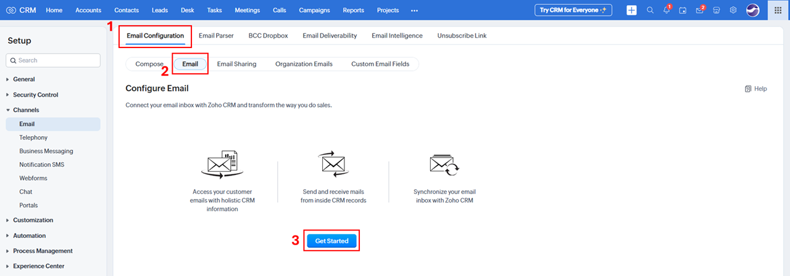
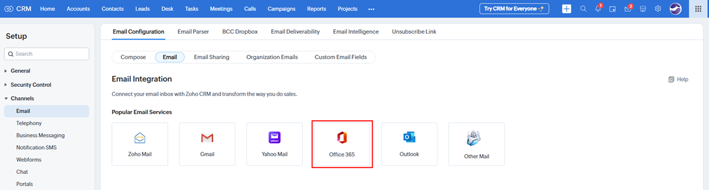
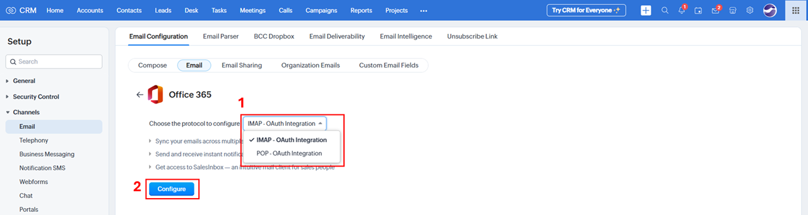
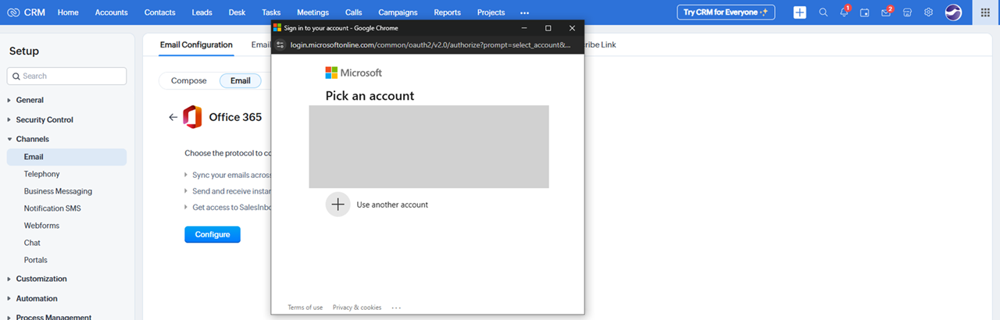
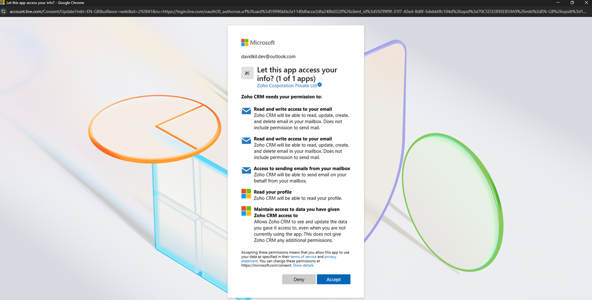
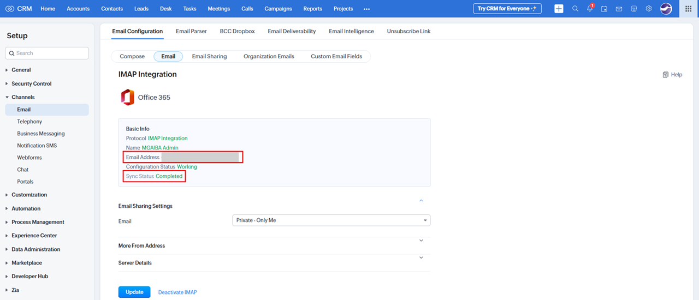

# OAuth IMAP Setup

**Version:** 1.0  
**Last Updated:** 4 June 2025  

---

To enable full email functionality (send and receive) in Zoho CRM, all users must configure OAuth IMAP before using the email module.

1. **Access Email Configuration**  
   In Zoho CRM, click the **Setup** icon (top-right corner).
   

   Under **Channels**, select **Email**.
   

2. **Start Email Setup**  
    Click **Email Configuration > Email**, then click the **Get Started** button.
   

3. **Choose Office 365**
   

4. **Choose IMAP Protocol**  
   Select **IMAP – OAuth Integration** as the protocol. Click **Configure**.
   

5. **Authenticate with Microsoft**  
   A Microsoft login pop-up will appear. Sign in using your Microsoft account.  
   _Note: The email address must match your Zoho CRM email._
   

6. **Accept Permissions**  
   When prompted with "**Let this app access your info?**", click **Accept**.
   

7. **Verify Integration**  
   After signing in, your Microsoft account will be linked to your Zoho CRM account.  
   Check the **Email Address** and **Sync Status**. If the Sync Status shows **Not Started** or **In Progress**, please wait until it changes to **Completed**.
   

8. **Confirmation**  
   Once the Sync Status is **Completed**, your setup is done.
