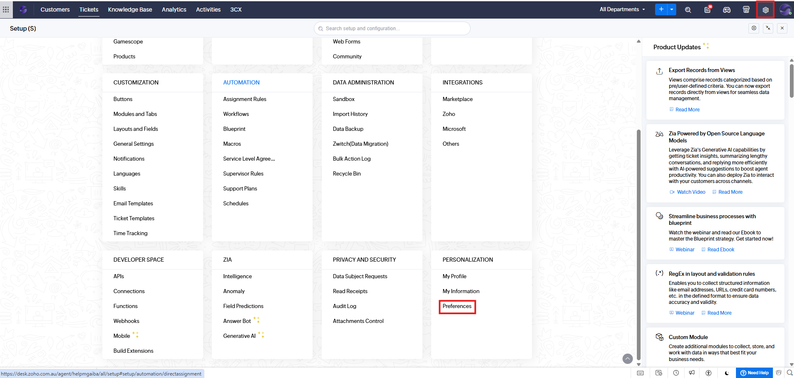
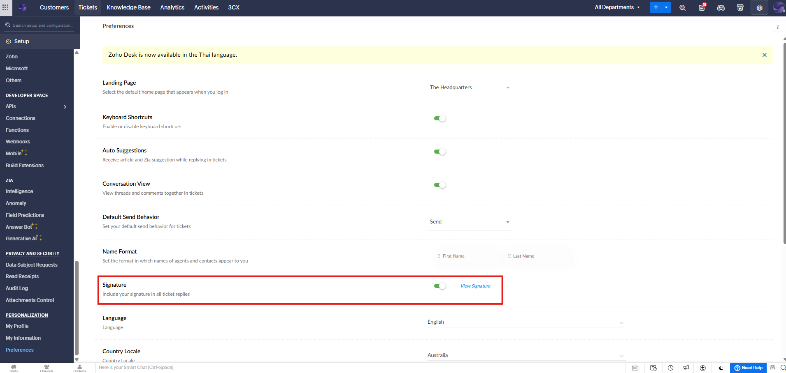
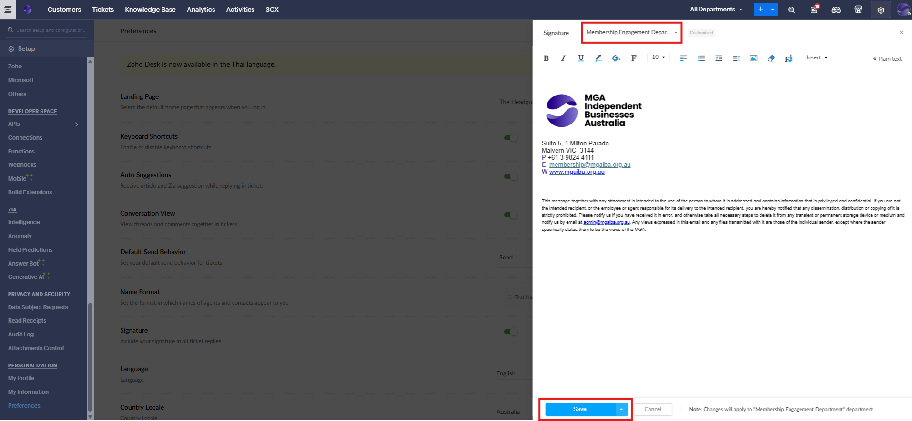

# Setting Up Email Signature in Zoho CRM and Zoho Desk

**Version:** 2.0  
**Last Updated:** 15 October 2025

---

## Overview

This guide outlines the steps to configure or update your email signature in both Zoho CRM and Zoho Desk.
Having a consistent email signature across both platforms ensures professional communication and aligns with your organisation’s branding guidelines.

---

## Setting Up Email Signature in Zoho CRM

1. **Access Email Configuration**  
   - In Zoho CRM, click the **Setup** icon located in the top-right corner.
   

   - Under **Channels**, select **Email**.
   

2. **Navigate to the Email Signature Section**  
   - On the **Email Configuration** page, go to the **Compose** tab.  
   - Scroll down to the **Email Signature** section.
   

3. **Edit and Save Your Signature**  
   - Make the necessary changes to your email signature.  
   - Click **Save** to apply your changes.

---

## Setting Up Email Signature in Zoho Desk

1. **Access Preferences**  
   - In Zoho Desk, go to **Setup → Preferences (Personalization)**.
   

2. **Locate the Signature Option**  
   - Scroll to **Signature** and click **View Signature**.
   

3. **Edit and Save Your Signature**  
   - Select the correct **Department**.
   - Modify the email signature as required.
   - Click **Save** to apply your changes.
   

---

## Notes

- Ensure your signature aligns with your organisation’s branding and tone of voice.
- You can include images, hyperlinks, and rich text formatting in your signature.
- If you manage multiple departments in Zoho Desk, update the signature for each department individually.
- For consistency, use the same signature format in both Zoho CRM and Zoho Desk.

---

