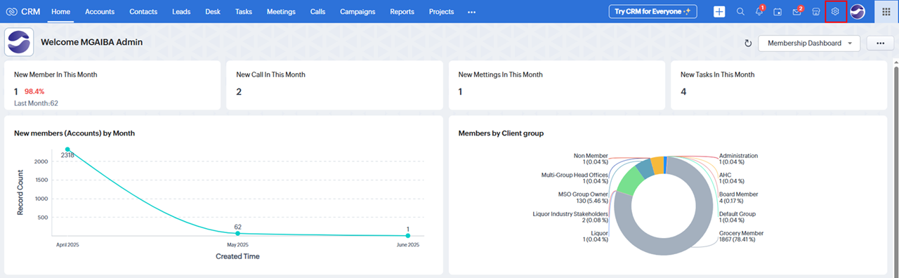
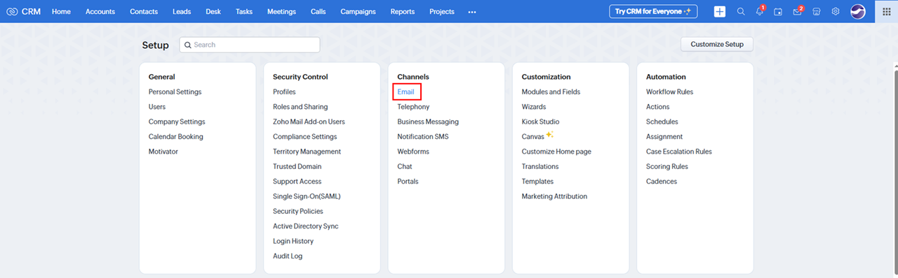
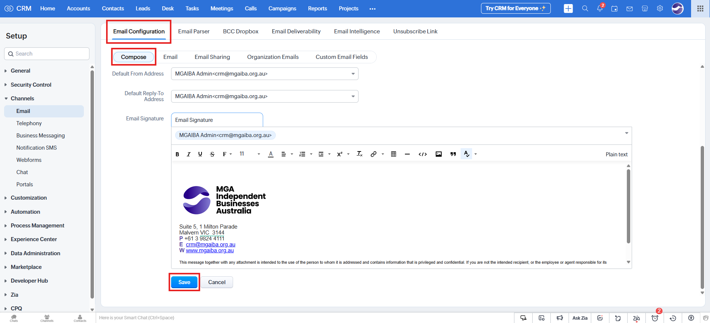

# Setting Up Email Signature in Zoho CRM

**Version:** 1.0  
**Last Updated:** 18 June 2025

---

## Overview

This guide outlines the steps to configure or update your email signature within Zoho CRM.

---

## Steps to Set Up Your Email Signature

1. **Access Email Configuration**  
   - In Zoho CRM, click the **Setup** icon located in the top-right corner.
   

   - Under **Channels**, select **Email**.
   

2. **Navigate to the Email Signature Section**  
   - On the **Email Configuration** page, go to the **Compose** tab.  
   - Scroll down to the **Email Signature** section.
   

3. **Edit and Save Your Signature**  
   - Make the necessary changes to your email signature.  
   - Click **Save** to apply your changes.

---

## Notes

- Ensure your signature aligns with your organisation’s branding guidelines.  
- You can include images, hyperlinks, and formatting in your signature if required.