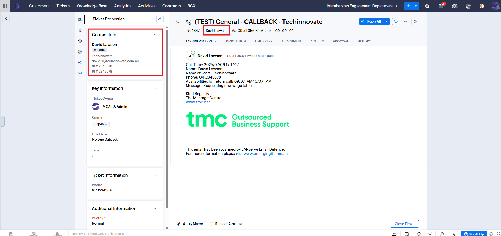

# Ticket Contact (Originator) Reassignment

**Version:** 1.0  
**Last Updated:** 10 July 2025

---

## Overview

When TMC (Call Centre) logs a ticket, the MGA Membership Engagement team is currently closing the TMC-created ticket and manually creating a new one using the correct contact from the original TMC ticket. However, it is not necessary to create a new ticket, as the contact on an existing ticket can be updated directly.

---

## Steps to Update a Contact

1. Open the ticket created by TMC and click **Edit Ticket**.
   

2. Update the **Contact Name** field to the appropriate contact and click **Save**.
   

3. Confirm that the ticket’s contact has been successfully updated. The ticket is now assigned to this contact, and you can communicate with them directly through the ticket or record any related correspondence within it.
   
