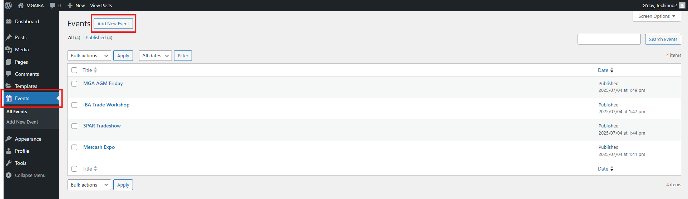
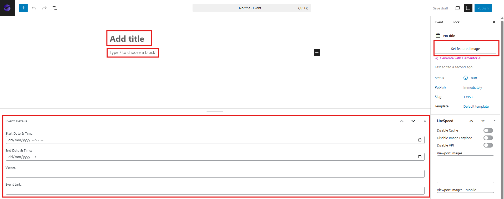
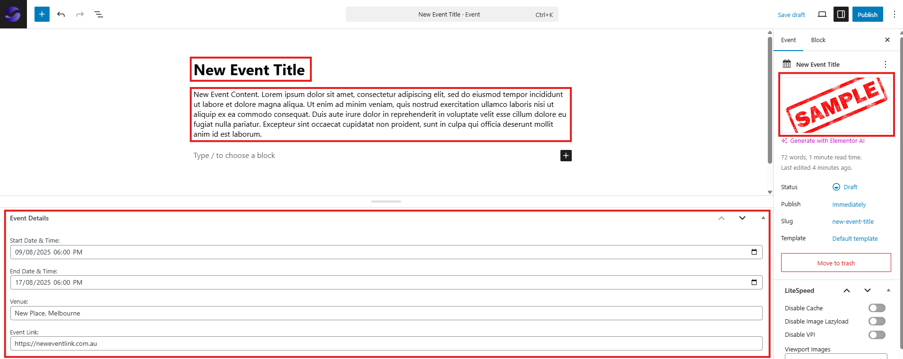
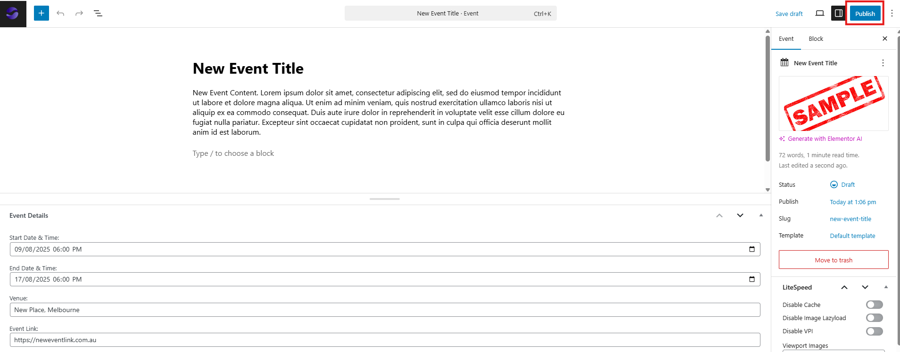
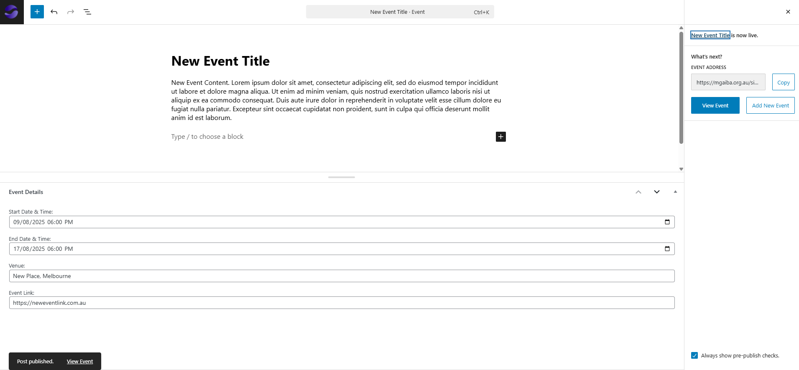

# Managing Events

**Version:** 1.0  
**Last Updated:** 8 August 2025

---

## Overview

This guide outlines the process for creating, editing, and deleting event entries on the website. Events are displayed on the **Upcoming Events** page.

---

## Terminology

- **Event Post:** An entry in the Events section that contains the event’s details, images, and links.
- **Featured Image:** The primary image displayed for the event.
- **Event Link:** A link to the event’s registration page or external information source.

---

## Adding a New Event

1. **Create a New Event**

   - Go to the **Events** tab and click **Add New Event**.  
     

2. **Enter Event Details**

   - Add the **title** and **description**.
   - Upload a **featured image**.
   - Set the **start date & time** and **end date & time**.
   - Enter the **venue**.
   - Add the **event link** (if applicable).  
       
     

3. **Publish the Event**

   - Click **Publish**, then click **Publish** again to confirm.  
     

4. **Confirm Publication**
   - A confirmation message will appear stating **"Post published"**.
   - The event will appear on the **Upcoming Events** page.  
     

---

## Editing an Existing Event

1. Go to the **Events** tab.
2. Hover over the event you want to edit and click **Edit**.
3. Make the required changes and click **Save**.

---

## Deleting an Event

1. Go to the **Events** tab.
2. Hover over the event you want to delete and click **Trash**.

---
