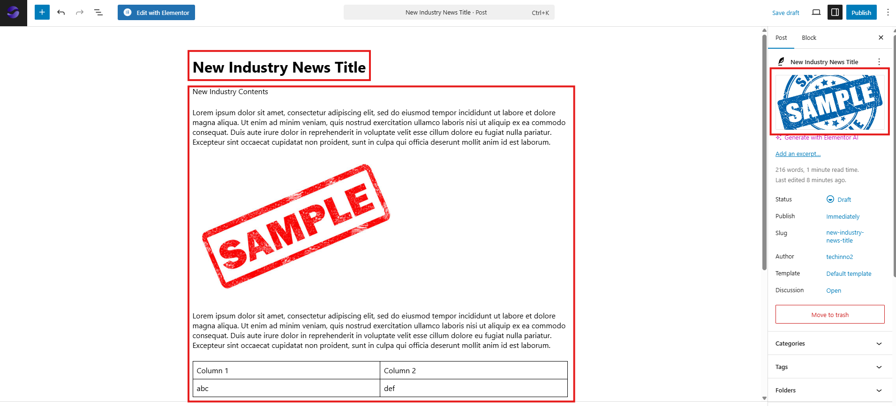

# Managing Industry News and Media

**Version:** 1.0  
**Last Updated:** 8 August 2025

---

## Overview

This guide outlines the process for creating, editing, and deleting Industry News posts on the website. Industry News updates appear on all sections of the website where the industry news list is displayed.

---

## Terminology

- **Post:** An individual article or update published on the website.
- **News Folder:** The designated storage location within the Posts tab for all Industry News articles.
- **EA Duplicator:** A quick method for creating a new post by duplicating an existing one.

---

## Adding New Industry News

There are two methods for adding a new Industry News post; however, the **EA Duplicator** method is recommended as it is faster.

1. **Go to the News Folder**

   - Navigate to the **Posts** tab and open the **News** folder.  
     

2. **Duplicate the Latest News Post**

   - Hover over the most recent news post and click **EA Duplicator**.
   - _(Alternatively, you may click **Add Post** to create a post from scratch, but the duplication method is quicker.)_  
     

3. **Edit the Duplicated Post**

   - Hover over the copied post and click **Edit**.  
     

4. **Update Post Content**

   - Change the **title**, **content**, and **featured image** as needed.  
       
     

5. **Set Categories and Folders**

   - In the right sidebar, locate **Categories** and **Folders** and ensure **News** is selected for both.
   - Click **Publish**, then click **Publish** again to confirm.  
     

6. **Confirm Publication**
   - A confirmation message will appear at the bottom-left of the screen indicating that the post has been published.
   - The new article will automatically appear wherever the industry news list is displayed.  
     

---

## Editing Existing Industry News

1. Go to the **Posts** tab and open the **News** folder.
2. Hover over the news post to edit and click **Edit**.
3. Make the required changes, then click **Save**.

---

## Deleting Industry News

1. Go to the **Posts** tab and open the **News** folder.
2. Hover over the news post to delete and click **Trash**.

---
