# Managing Magazines

**Version:** 1.0  
**Last Updated:** 8 August 2025

---

## Overview

This guide outlines the process for creating, editing, and deleting magazine posts on the website, as well as updating the Publications page to display new editions.

---

## Terminology

- **Magazine Post:** The article in the **Magazine** folder that contains the embedded magazine content.
- **Magazine Code:** The embed code used to display the magazine content.
- **Publications Page:** The website page displaying the list of available magazines.
- **EA Duplicator:** A quick method for creating a new post by duplicating an existing one.

---

## Adding a New Magazine

There are two methods for adding a new Magazine post; however, the **EA Duplicator** method is recommended as it is faster.

### Step 1 – Create the Magazine Post

1. **Go to the Magazine Folder**

   - Navigate to the **Posts** tab and open the **Magazine** folder.  
     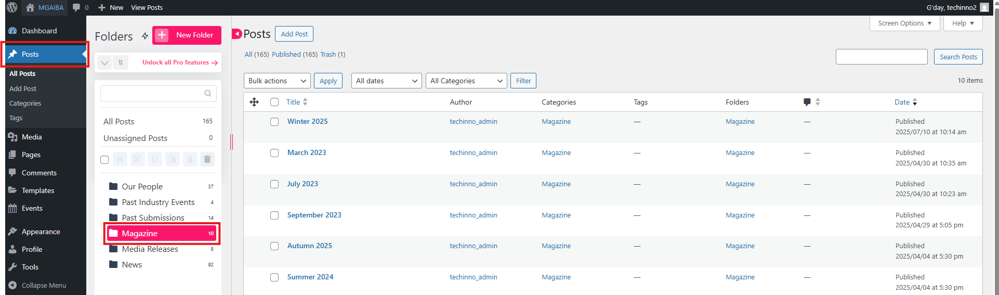

2. **Duplicate the Latest Magazine Post**

   - Hover over the most recent magazine post and click **EA Duplicator**.
   - _(Alternatively, you may click **Add Post** to create a post from scratch, but duplication is quicker.)_
     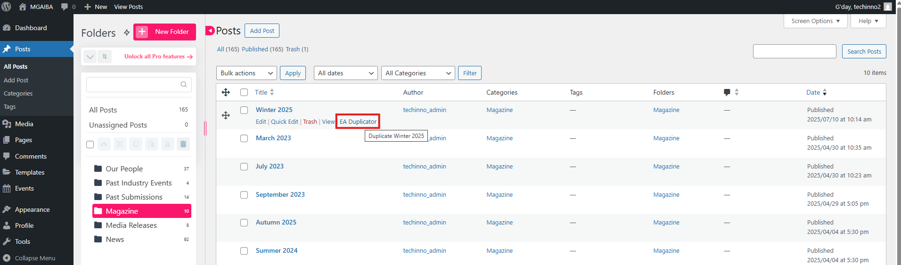

3. **Edit the Duplicated Post**

   - Hover over the copied post and click **Edit**.  
     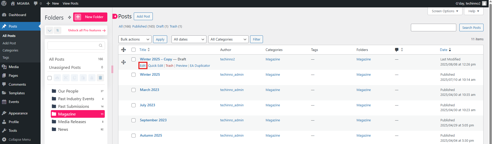

4. **Update Magazine Content**

   - Change the **title**.
   - Replace the **magazine embed code** with the code for the new edition.  
     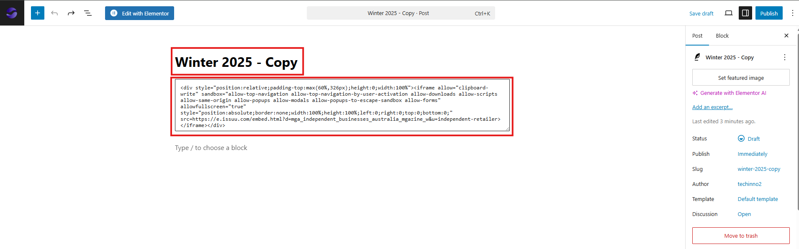  
     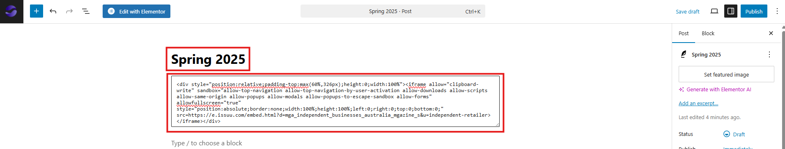

5. **Set Categories and Folders**

   - In the right sidebar, locate **Categories** and **Folders** and ensure **Magazine** is selected for both.
   - Click **Publish**, then click **Publish** again to confirm.  
     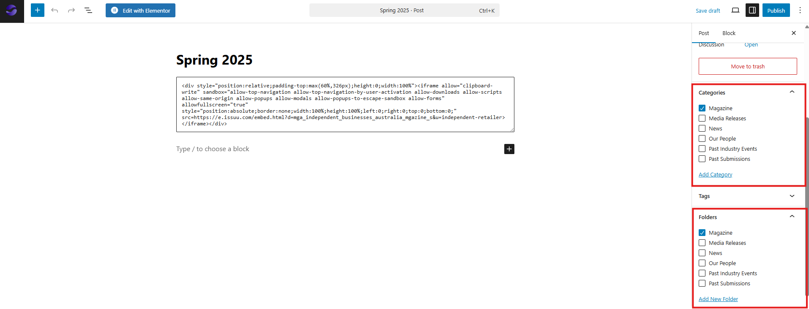

6. **Confirm Publication**
   - A confirmation message will appear at the bottom-left of the screen indicating that the magazine post has been published.  
     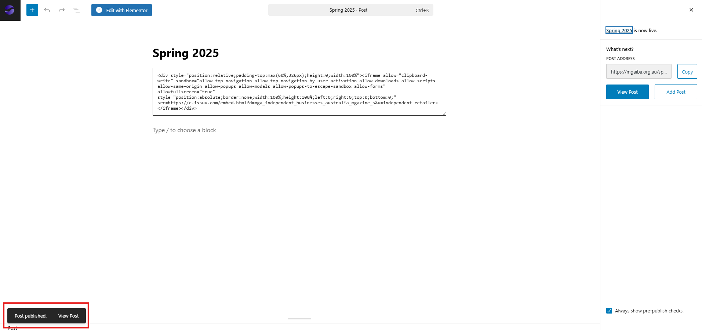

---

### Step 2 – Update the Publications Page

7. **Navigate to the Publications Page**

   - Go to the **Pages** tab and open the **Resources** folder.  
     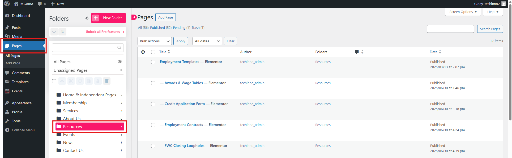

8. **Edit the Publications Page**

   - Find the page titled **Publications**.
   - Hover over it and click **Edit with Elementor**.  
     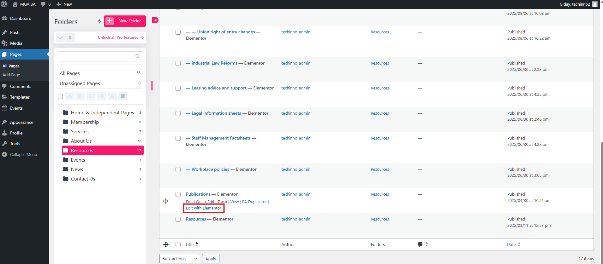

9. **Duplicate the Latest Magazine Entry**

   - In the page structure, locate the latest magazine entry.
   - Right-click and select **Duplicate**.  
     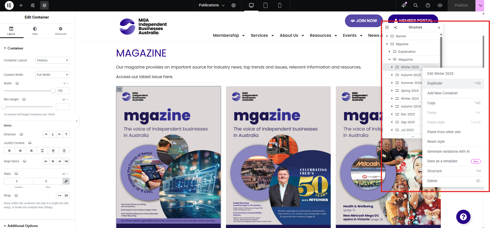

10. **Edit the Duplicated Magazine Entry**

    - **Change the container name**.  
      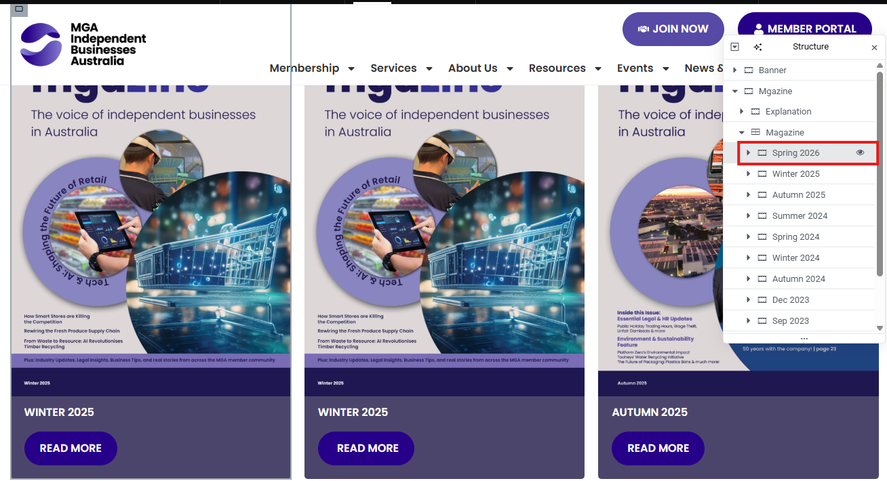
    - **Update the magazine image** by clicking the image and selecting the new file.  
      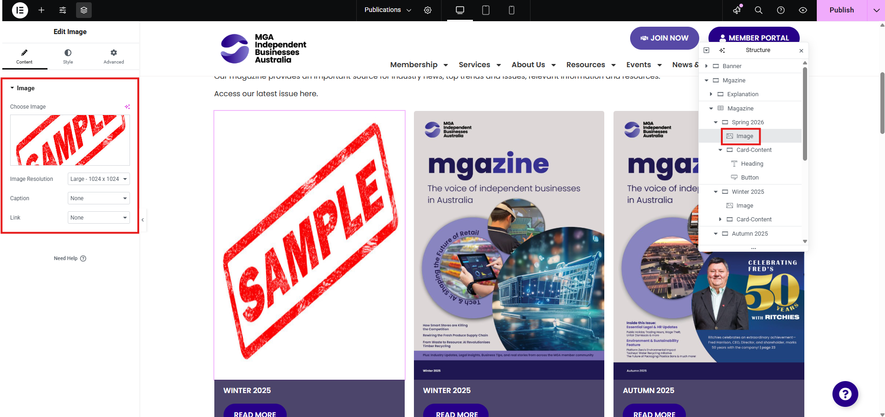
    - **Update the heading** to match the new edition.  
      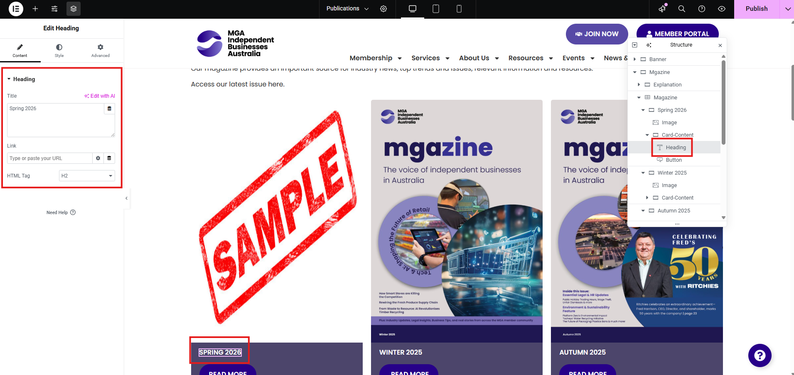
    - **Update the “Read More” link** to point to the new magazine post.  
      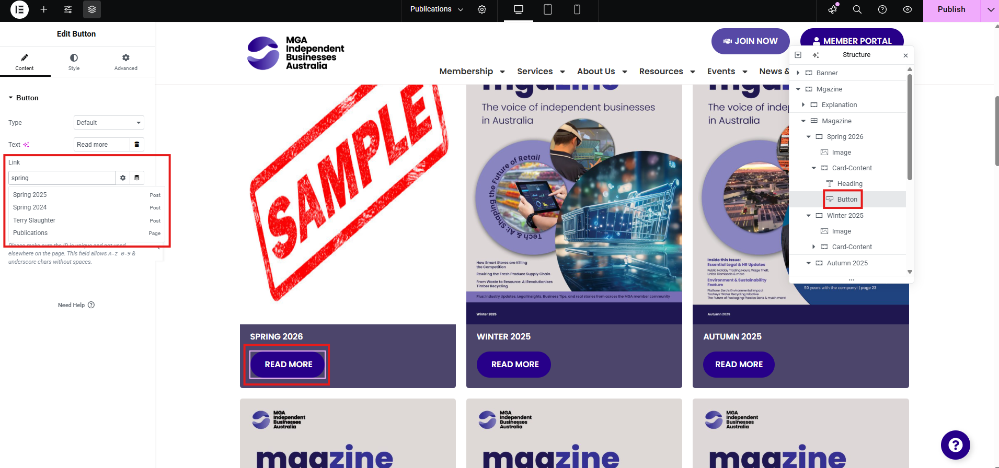

11. **Publish the Page**
    - Once all changes are complete, click **Publish**.
    - The new magazine will now appear on the Publications page.  
      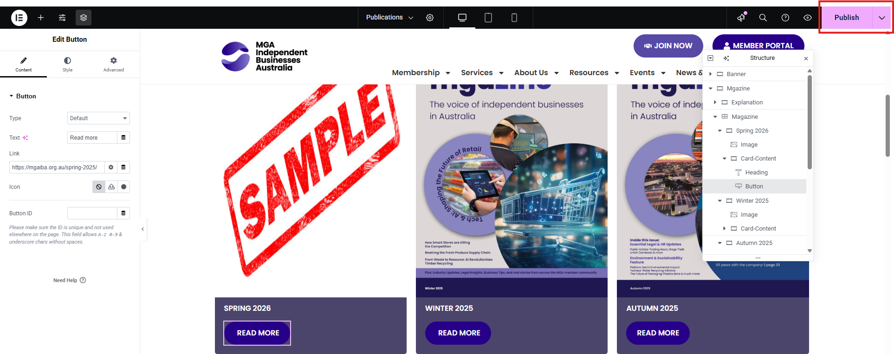

---

## Editing an Existing Magazine

- To edit a magazine, you must update **both** the Magazine Post and the corresponding entry on the Publications page.

---

## Deleting a Magazine

- To delete a magazine, you must remove it from **both** the Magazine Post list and the Publications page.

---
